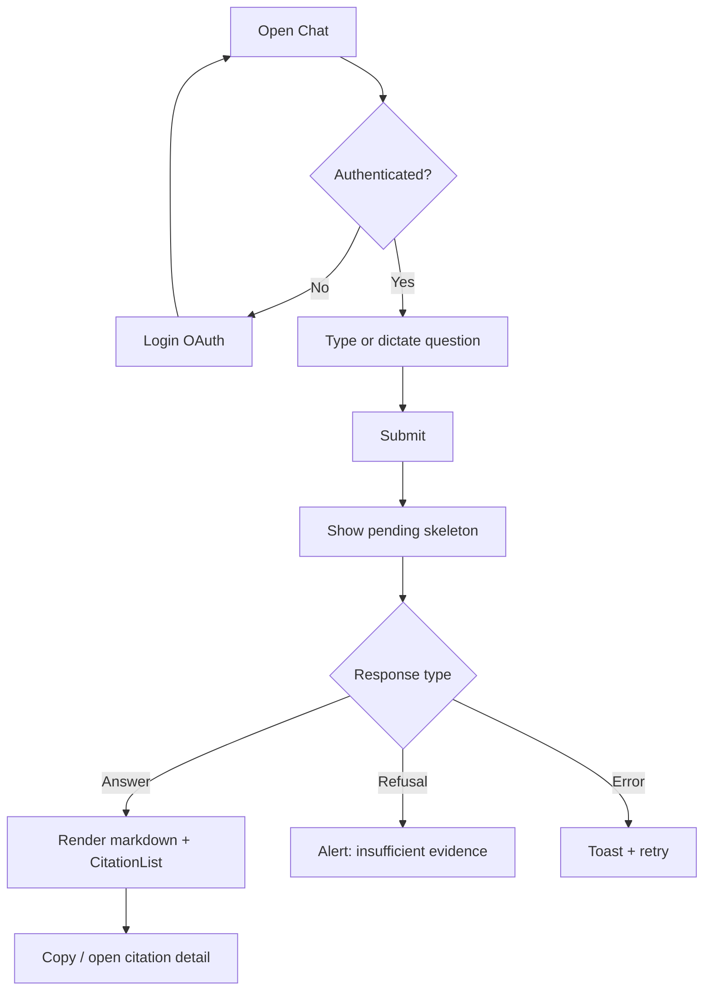
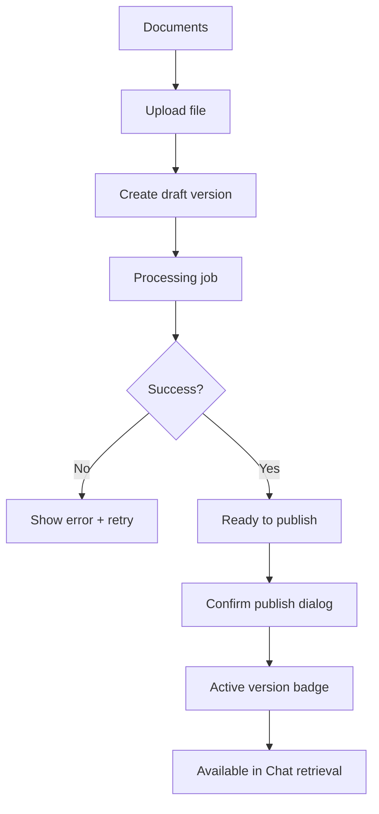
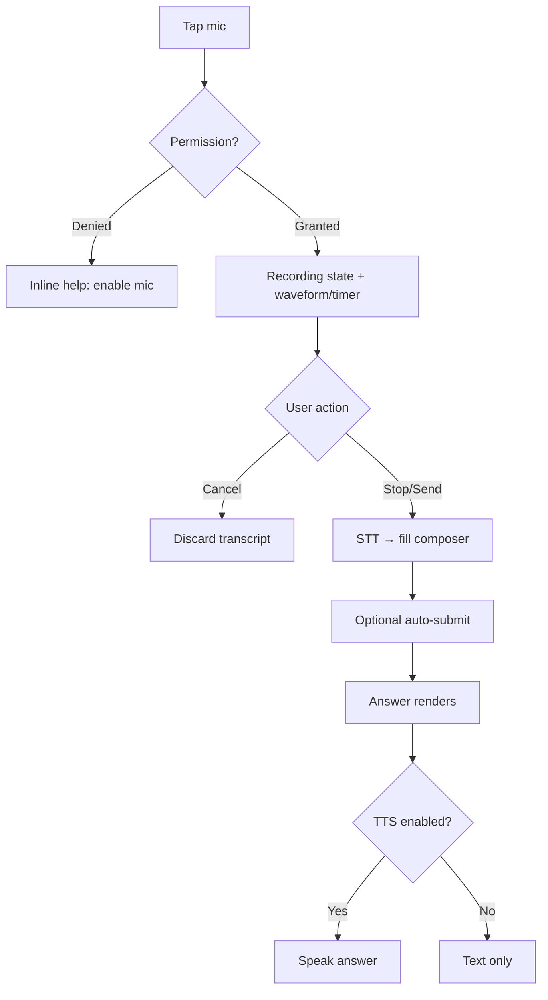

# Enterprise RAG Platform — UI / UX Specification

**Document version:** 1.1 (Phase 0 Gamma)  
**Date:** 2026-07-16  
**Status:** Requirements-locked UI contract  
**Stack alignment:** Next.js App Router · TypeScript · **shadcn/ui** · Tailwind · PWA  
**Auth audience:** `chandraailabs.com` + `gmail.com` only  

Related: [requirements.md](./requirements.md) · [architecture/overview.md](./architecture/overview.md) · [ADR-0002](./adr/0002-tech-stack.md)

---

## Table of contents

1. [Goals & principles](#1-goals--principles)
2. [Design system](#2-design-system-shadcnui)
3. [Information architecture](#3-information-architecture)
4. [Key user flows](#4-key-user-flows)
5. [Screens](#5-screens)
6. [Voice integration](#6-voice-integration)
7. [PWA requirements](#7-pwa-requirements)
8. [Responsive & layout](#8-responsive--layout)
9. [Accessibility](#9-accessibility)
10. [Empty, loading, error states](#10-empty-loading-error-states)
11. [Analytics UI (product)](#11-analytics-ui-product)
12. [Out of scope (UI)](#12-out-of-scope-ui)
13. [Traceability](#13-traceability)
14. [Multimodal rendering](#14-multimodal-rendering)
15. [Feedback (5-star)](#15-feedback-5-star)

---

## 1. Goals & principles

### 1.1 UX goals

| Goal | Design implication |
|------|--------------------|
| **Trust** | Citations always visible; version labels on sources |
| **Speed** | Chat-first home; minimal chrome for ask path |
| **Safety** | Clear refusals; no fake confidence |
| **Mobile-first** | Thumb-reachable compose + voice; progressive disclosure for admin |
| **Operable** | Admin and analytics usable without separate tools for MVP paths |

### 1.2 Design principles

1. **Chat is the product** — everything else is secondary navigation.  
2. **Evidence before eloquence** — show sources; prefer short grounded answers.  
3. **Fail honest** — offline, timeout, refusal, and ACL miss are explicit.  
4. **Least surprise** — destructive admin actions need confirm + undo window where feasible.  
5. **One design system** — shadcn/ui primitives only (no one-off CSS islands without reason).

---

## 2. Design system (shadcn/ui)

### 2.1 Foundation

| Layer | Choice |
|-------|--------|
| Components | **shadcn/ui** (Radix primitives + Tailwind) |
| Styling | Tailwind CSS utility classes |
| Icons | `lucide-react` (shadcn default) |
| Fonts | System UI stack initially; optional Inter via `next/font` later |
| Theme | Light default; dark mode token-ready (class strategy) |
| Forms | React Hook Form + Zod (recommended with shadcn form patterns) |

### 2.2 Core primitives (expected)

`Button`, `Input`, `Textarea`, `Card`, `Dialog`, `DropdownMenu`, `Sheet` (mobile nav), `Tabs`, `Badge`, `Alert`, `Toast`/`Sonner`, `Skeleton`, `Separator`, `ScrollArea`, `Tooltip`, `Avatar`, `Table`, `Select`, `Switch`, `Progress`.

### 2.3 Domain components (app-level)

| Component | Purpose |
|-----------|---------|
| `ChatMessage` | User/assistant bubbles; markdown safe-render |
| `CitationList` / `CitationChip` | Version-aware sources |
| `StarRating` | 1–5 star feedback under assistant messages (optional) |
| `AnswerTable` | Accessible HTML table for markdown/extracted tables |
| `AnswerImage` | Caption + alt; lazy-load multimodal figure |
| `Composer` | Textarea + send + mic |
| `SessionList` | History sidebar/sheet |
| `DocVersionBadge` | `v3 · published` style badge |
| `JobStatusPill` | ingest pipeline states |
| `OfflineBanner` | network awareness |
| `EmptyState` | illustration + CTA pattern |
| `MetricCard` | analytics KPI tile |

### 2.4 Visual tokens (initial)

| Token | Guidance |
|-------|----------|
| Radius | shadcn default (`0.5rem`) |
| Density | Comfortable (not dense tables on mobile) |
| Brand | Neutral slate + single accent (e.g. blue/violet) — finalize in implementation PR |
| Danger | Destructive variant only for retire/delete |
| Success | Publish complete, job success |

---

## 3. Information architecture

### 3.1 Primary nav (role-aware)

```
App shell
├── Chat                    [user+]
├── History                 [user+]
├── Documents (Admin)       [content_admin+]
├── Analytics               [operator, product via operator role, security_auditor]
└── Settings                [all: profile; admin: roles later]
```

### 3.2 Route map (App Router)

| Route | Screen | Roles |
|-------|--------|-------|
| `/login` | Login | public |
| `/` or `/chat` | Chat (default) | user+ |
| `/chat/[sessionId]` | Chat session | user+ (owner) |
| `/history` | Session history | user+ |
| `/admin/documents` | Document library | content_admin+ |
| `/admin/documents/[docId]` | Doc detail + versions | content_admin+ |
| `/admin/jobs` | Ingest jobs | content_admin+, operator |
| `/analytics` | Usage & ops metrics | operator+, security_auditor |
| `/settings` | Preferences / PWA / voice | user+ |
| `/offline` | Offline fallback | public (cached) |

Unauthorized routes → 403 page with link home (not silent empty).

### 3.3 App shell layout

```
┌──────────────────────────────────────────────────────────┐
│ Top bar: logo · env badge · user menu · install (if any) │
├────────────┬─────────────────────────────────────────────┤
│ Side nav   │  Main content                               │
│ (desktop)  │  (chat / admin / analytics)                 │
│            │                                             │
│ Sheet nav  │  Composer pinned bottom on chat (mobile)    │
│ (mobile)   │                                             │
└────────────┴─────────────────────────────────────────────┘
│ OfflineBanner (conditional)                              │
└──────────────────────────────────────────────────────────┘
```

---

## 4. Key user flows

### 4.1 End user — ask with citations



### 4.2 Content admin — publish version



### 4.3 Voice ask (Phase 5)



### 4.4 Install PWA

1. User opens site in supported browser.  
2. If `beforeinstallprompt` available → subtle Install button in top bar / settings.  
3. Else → Settings instructions (iOS Share → Add to Home Screen).  
4. After install, standalone display mode; splash via manifest icons.

---

## 5. Screens

### 5.1 Login (`/login`)

| Element | Spec |
|---------|------|
| Layout | Centered card, max-width ~400px |
| Primary CTA | “Continue with Google” (Button) |
| Copy | Product name + one-line value prop; note: org + gmail accounts only |
| Errors | OAuth failure Alert; **domain denied** Alert for non-allowlisted emails |
| A11y | Focus on CTA; keyboard only |

### 5.2 Chat (`/chat`)

**Purpose:** Primary product surface.

| Region | Spec |
|--------|------|
| Message list | Reverse-chronological or top-down chronological with auto-scroll to latest |
| User bubble | Align end; neutral bg |
| Assistant bubble | Align start; includes answer body (text + tables + images) + `CitationList` + **`StarRating`** |
| Refusal | `Alert` variant warning/destructive-soft — not styled as normal answer; **no star row required** (optional “was this helpful?” later) |
| Composer | Textarea auto-grow (max ~6 lines); Send button; Mic button |
| Collection filter | Optional Select (when US-QA-05 live) above composer — drives metadata filter |
| Streaming | If enabled: partial tokens + disabled double-send |

**Citation interaction:**
- Chip shows `Title · vN`.  
- Click → Sheet/Dialog with excerpt, version, locator, optional table/image preview, “copy citation”.  
- Deep link to source file only if ACL allows and signed URL available (later).

**Feedback:** see [§15](#15-feedback-5-star). **Multimodal:** see [§14](#14-multimodal-rendering).

### 5.3 History (`/history`)

| Element | Spec |
|---------|------|
| List | Session title (first question truncated), relative time |
| Actions | Open, delete (confirm) |
| Empty | CTA “Start a conversation” → Chat |
| Mobile | Full list; no dual-pane required for v1 |

### 5.4 Admin — Documents (`/admin/documents`)

| Element | Spec |
|---------|------|
| Table (desktop) | Name, collection, active version, updated, status |
| Cards (mobile) | Same fields stacked |
| Primary CTA | Upload |
| Filters | Status, collection, search by name |
| Row click | Doc detail |

### 5.5 Admin — Document detail

| Element | Spec |
|---------|------|
| Header | Title, collection, ACL labels |
| Versions timeline | Draft / processing / ready / published / retired |
| Actions | Publish, Retire (Dialog confirm), Re-index (operator) |
| Job panel | Latest job status + error summary |

### 5.6 Admin — Jobs (`/admin/jobs`)

| Element | Spec |
|---------|------|
| Table | Job id, doc, version, stage, status, started/finished |
| Retry | Button when failed + role allows |

### 5.7 Analytics (`/analytics`)

| Element | Spec |
|---------|------|
| KPI row | Queries, p50, p95, error %, refusal %, **avg stars**, **cache hit %** (when live) |
| Charts | Volume over time; latency trend; star histogram (library TBD: recharts common with shadcn) |
| Notes | Banner: “Metadata only — no raw queries” |
| Filters | Date range, environment |

### 5.8 Settings (`/settings`)

| Section | Spec |
|---------|------|
| Profile | Name, email (from IdP) |
| Voice | TTS on/off, language (when available) |
| PWA | Install instructions + status |
| Appearance | Theme light/dark (if enabled) |

### 5.9 Global: 403 / 404 / 500

Use shadcn `Card` + clear recovery actions; never blank screen.

---

## 6. Voice integration

### 6.1 Controls

| Control | Behavior |
|---------|----------|
| Mic idle | Outline icon button in Composer |
| Mic active | Destructive/pulse state; timer; Cancel |
| Partial transcript | Live text in composer (if streaming STT) |
| TTS toggle | Settings + optional icon on assistant message (“Speak”) |

### 6.2 States

| State | UI |
|-------|-----|
| Unsupported browser | Tooltip + disabled mic with reason |
| Permission denied | Alert with browser-specific help |
| Network error mid-STT | Toast; preserve partial text |
| TTS playing | Stop control on message |

### 6.3 Privacy UX

- Mic indicator must be obvious while capturing.  
- Do not auto-start mic on page load.  
- Voice audio not stored client-side beyond session needs; server retention per privacy NFRs.

### 6.4 Provider abstraction

UI talks only to backend voice endpoints (or approved browser STT for prototype). Provider swap is server/config concern (US-VOICE-03) — UI shows feature flags: `voiceInputEnabled`, `voiceOutputEnabled`.

---

## 7. PWA requirements

### Phase 5 delivery profile (locked; ADR-0010)

| In scope | Out of scope |
|----------|--------------|
| Responsive web UI on **desktop, tablet, and mobile browsers** | Native iOS App Store apps |
| **Installable PWA** (manifest + service worker app shell) | Native Android Play Store apps |
| Optional voice (STT/TTS) inside the PWA | Separate native codebases |
| Offline **shell** (not full offline RAG) | Offline answers |
| **Backend version auto-reload** (poll `/health`; hard reload on change) | Soft “please refresh” only |

One web stack (Next.js PWA). No dual native product track. Auth: Google OAuth + domain allowlist; roles from backend — [ADR-0009](./adr/0009-authn-authz-user-profiles.md) · [ADR-0010](./adr/0010-pwa-shell-version-reload.md).

### 7.1 Manifest (minimum)

| Field | Guidance |
|-------|----------|
| `name` / `short_name` | Enterprise RAG / ERP |
| `start_url` | `/chat` |
| `display` | `standalone` |
| `background_color` / `theme_color` | Match theme tokens |
| Icons | 192 + 512 PNG; maskable where possible |

### 7.2 Service worker

| Capability | Phase | Behavior |
|------------|-------|----------|
| Precache app shell | 5 | HTML/CSS/JS shell |
| Runtime cache static assets | 5 | Cache-first for hashed assets |
| API calls | 5 | Network-first; never cache authenticated answers long-term by default |
| Offline fallback | 5 | `/offline` + banner on Chat |
| Push notifications | Out of scope v1 | — |

### 7.3 Install UX

- Prefer non-blocking Install control when event available.  
- Document iOS limitations in Settings help text.  
- After install, hide redundant install CTA.

### 7.4 Offline rules

| Action | Offline behavior |
|--------|------------------|
| Open app | Show shell + OfflineBanner |
| Send chat | Disable send; explain reconnect |
| Browse history | Show last cached list if present; else empty + offline |
| Admin mutations | Disabled |

---

## 8. Responsive & layout

### 8.1 Breakpoints (Tailwind defaults)

| Name | Width | Shell behavior |
|------|-------|----------------|
| `sm` | 640px | — |
| `md` | 768px | Side nav may collapse to icons |
| `lg` | 1024px | Persistent side nav |
| `xl` | 1280px | Optional dual-pane history + chat |

### 8.2 Mobile-first rules

1. Chat composer sticky bottom with safe-area insets.  
2. Primary actions ≥ 44×44 px touch targets.  
3. Tables → card lists below `md`.  
4. Admin multi-step flows use full-screen sheets on mobile.  
5. Avoid hover-only affordances for critical actions.

### 8.3 Desktop enhancements

- Optional split: history | chat at `xl`.  
- Keyboard: `⌘/Ctrl+Enter` send; `Esc` close dialogs; `/` focus composer (if not in input).

---

## 9. Accessibility

| Requirement | Implementation notes |
|-------------|----------------------|
| WCAG 2.2 AA (target) | Contrast, labels, structure |
| Landmarks | `nav`, `main`, `complementary` for citations panel |
| Live regions | `aria-live` for new assistant messages and job status |
| Mic button | `aria-pressed` when recording; clear accessible name |
| Focus | Trap in dialogs; return focus on close |
| Motion | Respect `prefers-reduced-motion` for pulses/animations |
| Markdown | Sanitize HTML; heading order sensible in answers |

---

## 10. Empty, loading, error states

| Context | Empty | Loading | Error |
|---------|-------|---------|-------|
| Chat new | Welcome + example prompts | Skeleton bubbles | Toast + inline Alert |
| History | CTA to Chat | Skeleton rows | Retry |
| Documents | Upload CTA | Skeleton table | Alert + retry |
| Jobs | “No jobs yet” | Skeleton | Error row |
| Analytics | “No data in range” | Skeleton cards | Alert |
| Citations | Hidden if none (refusal path) | — | “Source unavailable” |

Example prompts (editable copy):  
- “What is the leave policy accrual rate?”  
- “How do I request equipment?”  
- “Summarize the latest security policy changes.”

---

## 11. Analytics UI (product)

**Audience:** operators / product (via role).  
**Privacy banner always visible.**

### 11.1 KPI definitions (UI labels)

| KPI | Definition shown in tooltip |
|-----|----------------------------|
| Queries | Count of completed query requests |
| p50 / p95 | End-to-end latency percentiles |
| Error rate | 5xx + client-visible failures / total |
| Refusal rate | Insufficient-evidence + policy blocks / total |

### 11.2 Non-goals for charts

- No display of raw queries or answer text.  
- No user-level leaderboards with clear names (hashed only if ever needed).

---

## 12. Out of scope (UI)

- **Native mobile apps** (iOS/Android store) — Phase 5 is full PWA only (desktop/tablet/mobile browser + installable)  
- Real-time multi-user co-editing  
- WYSIWYG document authoring (upload/version only)  
- Full design-marketing site  
- Custom illustration system (use simple Lucide + empty states)  
- Free-text feedback comments in MVP (stars only)  
- Global LB / Cloud Armor UX (infra later)

---

## 13. Traceability

| Spec area | Requirements |
|-----------|--------------|
| Chat + citations | US-EU-02, US-EU-03, US-QA-*, US-PWA-03 |
| 5-star feedback | US-EU-08, US-QA-06, NFR-UX-03 |
| Multimodal | US-EU-09, US-MM-01, US-MM-02 |
| Admin docs/versioning | US-CA-*, US-DOC-* |
| Voice | US-EU-06, US-VOICE-* |
| PWA | US-EU-07, US-PWA-* |
| Analytics UI | US-PO-*, US-ANL-* |
| A11y / mobile | NFR-A11Y-*, NFR-UX-* |
| Design system | NFR-MNT-05, ADR-0002 |

---

## 14. Multimodal rendering

### 14.1 Tables

| Rule | Spec |
|------|------|
| Source | Markdown tables in model output **or** structured table payload from retrieval |
| Render | Semantic `<table>` via `AnswerTable` (shadcn Table primitives OK) |
| Mobile | Horizontal scroll container; do not crush columns unreadably |
| A11y | Header row (`th`), caption if provided |
| Failure | If parse fails, show fenced plain text fallback |

### 14.2 Images

| Rule | Spec |
|------|------|
| Source | Signed/authorized URL for version-bound asset from API |
| Render | `AnswerImage`: max-width 100%, lazy loading, blur placeholder optional |
| Alt / caption | Required alt (fallback: “Figure from {doc title} vN”) |
| ACL | If 403 on asset, show broken-image state + “source restricted” |
| Click | Optional lightbox Dialog for larger view |
| Privacy | No hotlink to unauthenticated GCS; always via API or short-lived signed URL |

### 14.3 Placement in message

```
[Assistant markdown prose]
[AnswerTable …]
[AnswerImage …]
[CitationList]
[StarRating]     ← always below content when answer succeeded
```

---

## 15. Feedback (5-star)

### 15.1 Placement & behavior

| Rule | Spec |
|------|------|
| Where | Directly under every **successful** assistant message (after citations) |
| Control | `StarRating`: 5 buttons/icons (Lucide star); fill 1…n on select |
| Optional | User may ignore forever — **non-blocking** (NFR-UX-03) |
| Change | Allow change until session ends or permanently (prefer allow update) |
| Pending | Optimistic UI; revert + toast on API error |
| Loading | Disable stars while message still streaming |
| Refusal | Stars optional/hidden for pure refusals (product default: **hidden**) |

### 15.2 Copy & a11y

- Group label: “Rate this answer” (`aria-label`).  
- Each star: “{n} stars”.  
- After submit: subtle “Thanks” text; no modal.  
- Do not force comment field in MVP.

### 15.3 Analytics UI

- Product analytics shows aggregate stars only (US-PO-04); not individual user emails.
